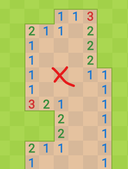

# WSFR - Challenge 2 - Démineur

*(Temps estimé : 2h30)*

## Principe :
Le but est de creuser le terrain en évitant les mines, en s'aidant d'indices découverts à chaque coup de pelle.  

- Chaque case est soit couverte, soit découverte :  
  - Non découverte, état par défaut  

  - Découverte  
  

- Chaque case peut contenir des éléments :
  - Une mine, qui, si elle est découverte, fait perdre la partie immédiatement.
  - Un drapeau, qui permet de marquer une case non découverte comme étant potentiellement minée.
  - Un chiffre, qui indique le nombre de mines présentes sur les 8 cases adjacentes (horizontal, vertical, diagonales)

### Tâches du sujet :
- Lors du début de la partie, 10 mines doivent être placées au hasard sur le plateau de jeu. Deux ou plusieurs mines ne peuvent pas se trouver sur la même case.

- Si une case possède 1 ou plusieurs mines dans ses 8 cases adjacentes, elle doit posséder un indicateur reflétant le nombre de mines :  
  

- Ces indicateurs sont cachés jusqu'à ce que la case soit révélée.

- Le temps commence à s'écouler dès le 1er clic sur le plateau. Il doit s'afficher en haut à gauche sous la forme MM:SS.

- Un clic gauche permet de creuser une case. Elle devient donc "découverte" et révèle soit rien, soit une mine, soit un chiffre.

- Un son doit être joué lorsqu'une case est creusée. Si la case contient une mine, jouer le son "explosion.mp3". Sinon, jouer "shovel.mp3".

- Si cette case **ne révèle rien**, et que d'autres cases adjacentes sont également vides, révéler ces cases en répétant l'opération jusqu'à tomber sur des cases non-vides.  
(Exemple en creusant sur la case marquée d'une croix)
  

- Si cette case révèle une mine, la partie s'arrête. Un message "Perdu ! Voulez-vous recommencer ?" s'affiche. Une réponse affirmative permet de commencer une nouvelle partie. Autrement, le tableau des meilleurs scores s'affiche.

- Un clic droit sur une case permet de placer un drapeau, ou de le retirer de cette case. Il est impossible de placer un drapeau sur une case déjà découverte. Il est possible de creuser sur une case où un drapeau est posé. Il faut toutefois retirer le drapau de la case.

- L'indicateur de drapeaux en haut à droite doit afficher en temps réel le nombre de mines présentes - le nombre de drapeaux posés. Ce nombre peut être négatif.  
Exemple : S'il y a 10 mines sur le plateau, et 5 drapeaux posés, afficher 5.

- Si toutes les cases non découvertes cachent une mine, la partie s'arrête. Le jeu arrête l'écoulement du temps et demande le nom de l'utilisateur.

- Si le joueur entre dans les 3 meilleures performances (= les 3 temps les plus bas pour découvrir les mines), son nom et son temps sont ajoutés au top 3.

- Le joueur est ensuite redirigé vers le top 3.

- Les temps affichés dans le top 3 doivent être affichés sous le format "Xmn Ysec"

- Ce top 3 doit être conservé entre les différentes parties sur le même navigateur.
  - Scénario type :
    - Le joueur gagne pour la 1ère fois une partie, son nom est ajouté en 1ère place.
    - Le navigateur est fermé
    - Le joueur revient, gagne pour la 2e fois une partie mais avec un temps supérieur. Son nom doit être placé en 2e position, et le nom du 1er joueur doit toujours apparaître avec son temps.

### Indications supplémentaires
- Il n'y normalement pas besoin d'écrire de HTML/CSS additionel pour résoudre ce sujet.

- Vous pouvez utiliser le code source fourni comme bon vous semble, mais l'apparence du projet ne doit pas être altérée sur le rendu final.